# 📘 Dokumentasi Project CodeIgniter 4 - Lab 11

## 🙋‍♂️ Identitas

- **Nama:** Indra Maha Resi  
- **NIM:** [312310044]  
- **Kelas:** [TI.23.C1]  
- **Nama Project:** PRAKTIKUM WEB2 

---

## 📁 Deskripsi Singkat

Proyek ini dibuat untuk  memenuhi tugas Praktikum Web2

---

## 📸 Dokumentasi Langkah-langkah

> Semua screenshot disimpan dalam folder `Dokumentasi/` di dalam proyek.

---

### 🧱 Praktikum 1: Setup Project CodeIgniter 4

- Download dan ekstrak CodeIgniter 4 ke dalam folder `htdocs/lab11_ci/ci4`.
- Jalankan perintah berikut di terminal:

```bash
php spark serve
```
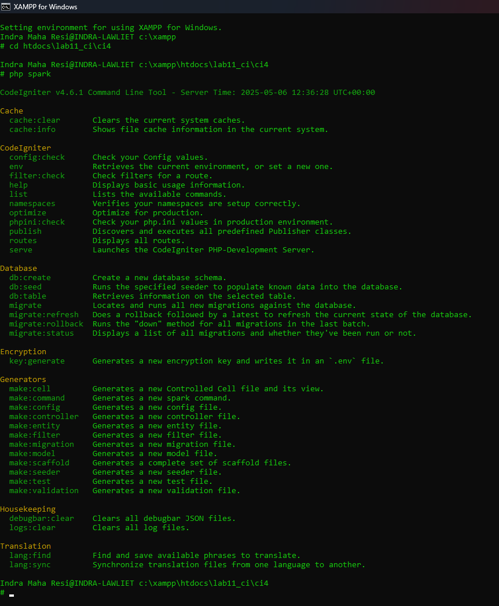


- Menjalankan Xampp
  
  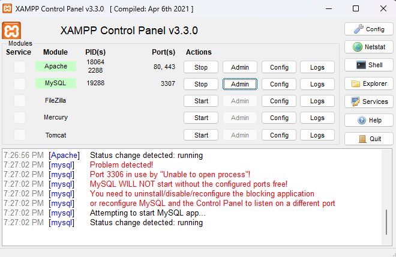

- CodeIgniter 4 berhasil di jalankan

  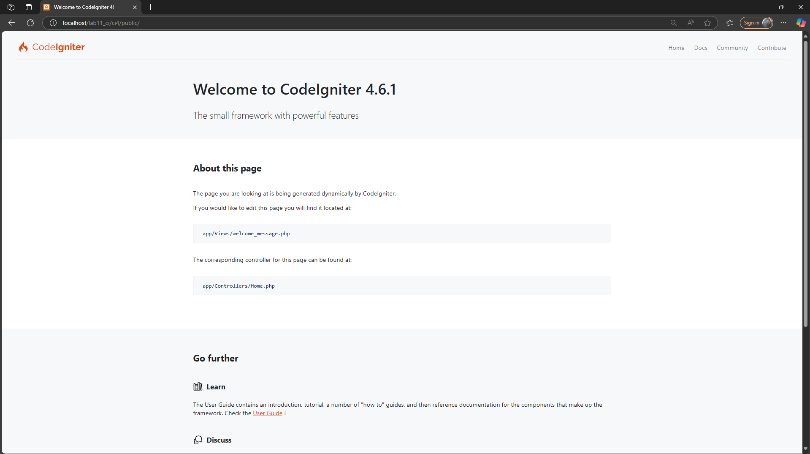

- Membuat .env untuk melihat eror mode Development

  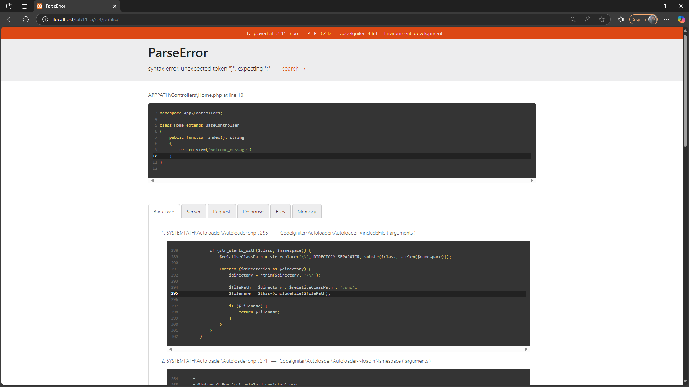

- Membuat Controller (Contoh: About)

   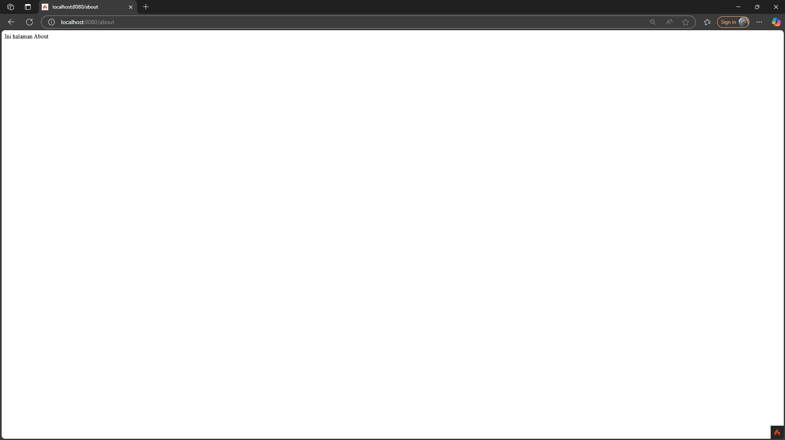

- Membuat dan mengecek Routes
  dengan menjalan kan :
  ```bash
  php spark routes
  ```
 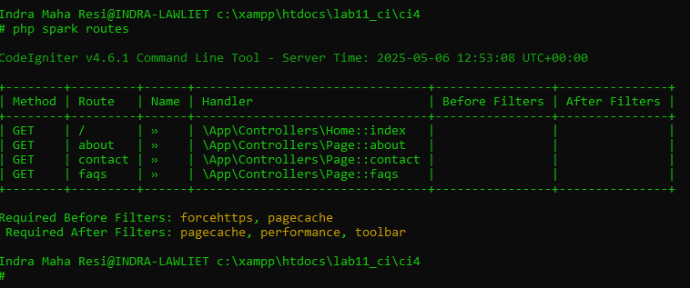
 
- Membuat Autoroutes dan membuat Controllernya (contoh setelah autoroutes)

  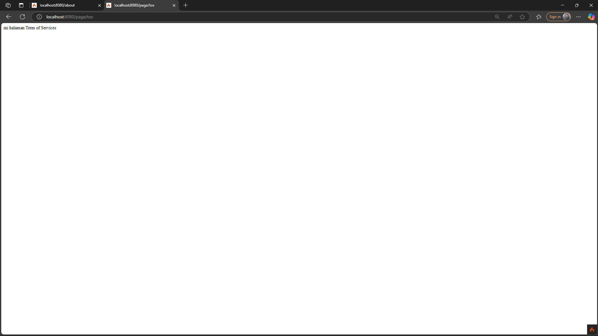
  
- Menambahkan Style.css

  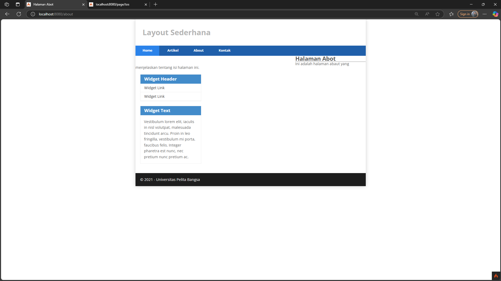


  ### 🧱 Praktikum 2:CRUD

  - Menambahkan Database

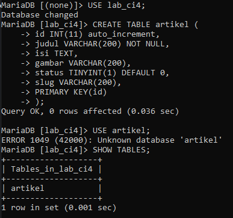

- Menambahkan Page Artikel

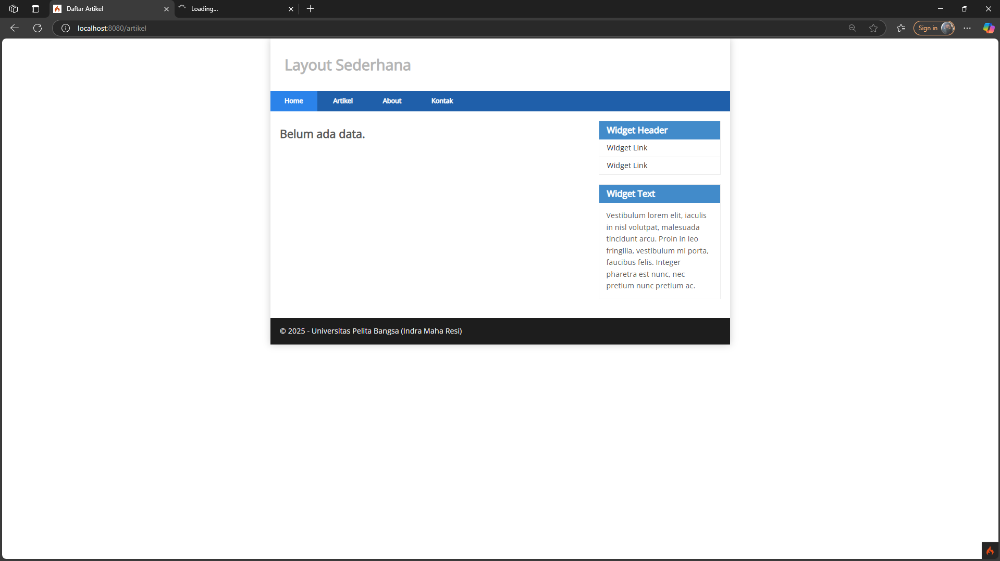

- Menambahkan Page Isi Artikel

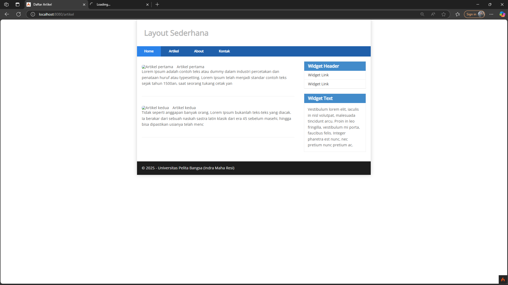

- Menambahkan Page detail Artikel


- Menambahkan Page Admin Artikel


- Menambahkan Page edit Artikel


- Menambahkan Page tambah/add Artikel

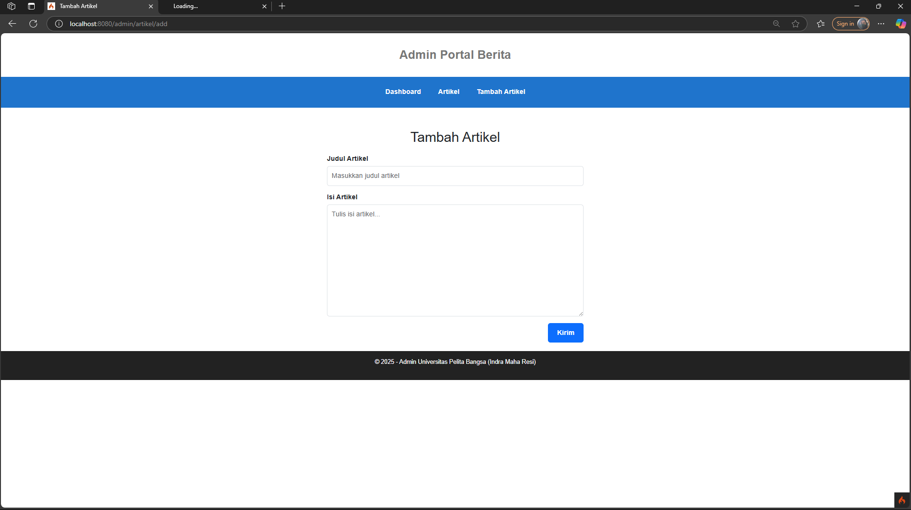
=======
---

## Pratikum 3: View Layout dan View Cell

- Membuat page beranda menggunakan Layout Sederhana

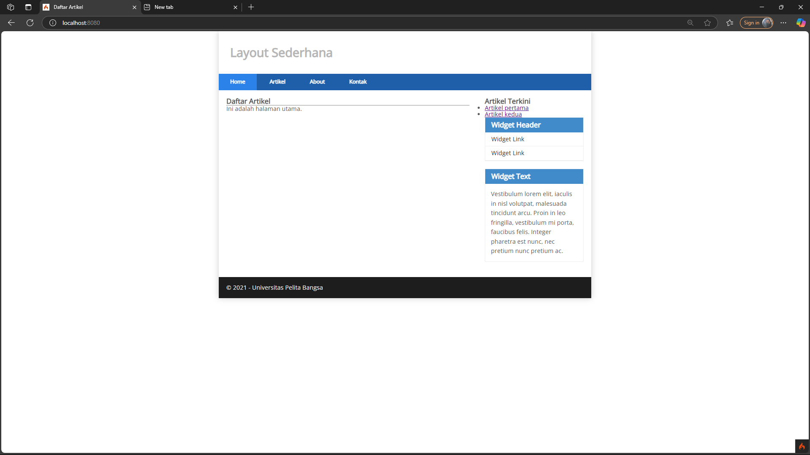

- Menambahkan View Cell untuk menampilkan data dari database (menambahkan create_at)

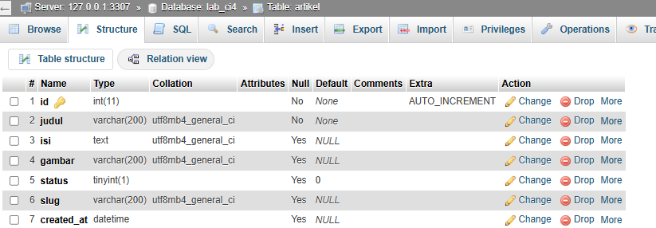

### Manfaat Utama Penggunaan View Layout
View Layout memungkinkan pengembang untuk mendefinisikan kerangka dasar (layout) yang konsisten di seluruh halaman aplikasi. Dengan menggunakan View Layout, pengembang dapat:
- Mengurangi duplikasi kode dengan mendefinisikan elemen-elemen umum seperti header, footer, dan sidebar di satu tempat.
- Mempermudah pemeliharaan kode karena perubahan pada layout hanya perlu dilakukan di satu file.
- Meningkatkan konsistensi tampilan di seluruh halaman aplikasi.

### Perbedaan antara View Cell dan View Biasa
- **View Cell**:
  - Digunakan untuk memuat komponen kecil yang dapat digunakan kembali, seperti widget atau elemen dinamis.
  - Memiliki logika sendiri yang dapat diisolasi dari controller utama.
  - Dapat menerima parameter untuk menyesuaikan data yang ditampilkan.
- **View Biasa**:
  - Digunakan untuk menampilkan halaman penuh atau bagian besar dari aplikasi.
  - Biasanya bergantung pada data yang dikirimkan dari controller utama.
  - Tidak memiliki logika terpisah seperti View Cell.

# Lab7Web
Tugas Praktikum Pemrogaman Web2 
>>>>>>> f83c8fd3cc803144ad2df9967199433ed2f9255c
